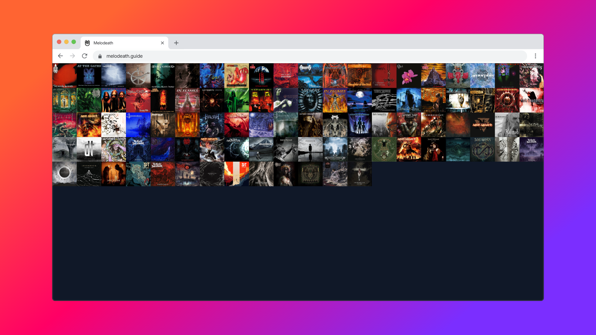

<center>

# Melodeath.guide



**A chronological and visual guide to the most influential melodic death metal albums for those who want to explore or revisit the genre from its roots.**

[Live demo](https://melodeath-guide.netlify.app/)

</center>


## 📖 Overview

**Melodeath.guide** is more than just a list of records.  
It's a curated journey through time, with reviews that explain **each album’s impact on the genre** and its historical context.

Ideal for:
- New listeners looking for a structured introduction
- Fans revisiting the genre’s milestones
- Metal enthusiasts studying the evolution of melodeath

Albums are displayed in **chronological order**, starting from the early 1990s.

Currently, the site features around **100 key records**, with more to be added over time.

## 💡 Why I built this
This is my **first full project** using React and Tailwind. I’m using it as a learning experience while building something I'm passionate about.

This project comes from two personal passions:

1. **Melodic death metal**, especially the 90s scene  
2. **Modern web development**, which I'm currently learning

It’s a way to practice coding while giving back to a genre I like.

## 🛠️ Built With

- React  
- Tailwind CSS
- Local database using a **JavaScript object**
- Hosted at Netlify

## 🚀 Getting started

You will need `node.js` and `git` installed globally on your machine.

1. Clone the repository:

   ```bash
   git clone https://github.com/yourusername/project-name.git
   cd project-name
   ```

2. Installation: `npm install`

3. In the project directory, you can run: `npm run dev`

Runs the app in the development mode.\
Open [https://localhost:5173](https://localhost:5173) to view it in the browser.

## 📄 License

This project is licensed under the MIT License - see the [LICENSE.md](https://github.com/leknod/melodeath-guide/blob/main/LICENSE) file for details.

## 🧑‍💻 Author